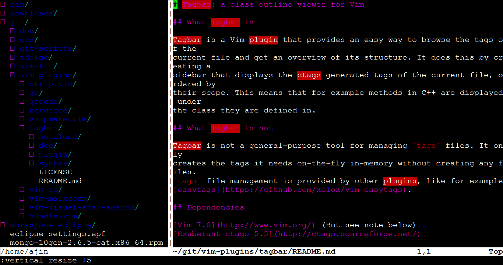
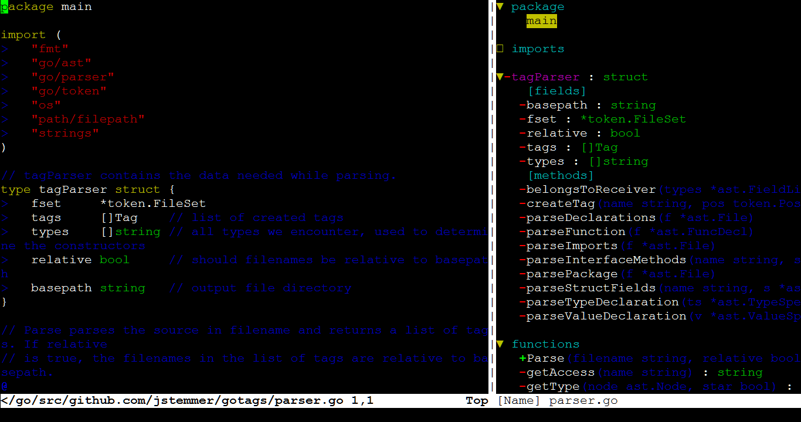
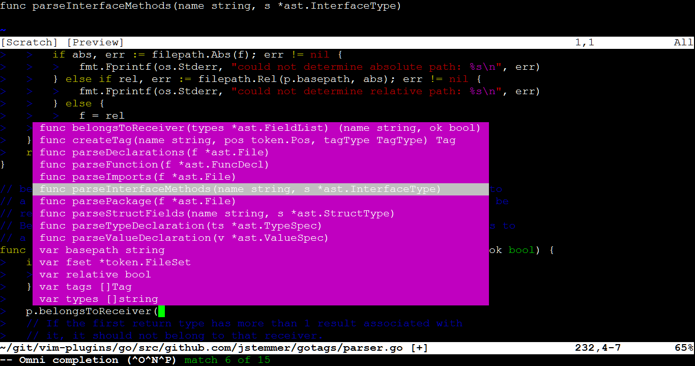

# VIM Kit
VIM Kit offers a very easy way to enhance your VIM editor
by integrating with some quite useful VIM plugins.

## Install (or update everything to latest)
1. mkdir ~/git
3. cd ~/git
4. git clone https://github.com/toalexjin/vim-kit.git
5. ~/git/vim-kit/update // Do `install` as well as `update`.

## Examples
- Press `<F2>` to switch windows.
- Press `<F3>` to hide current window.
- Press `<F4>` to toggle source code outline panel (Plugin `tagbar`).
- Press `<F5>` to toggle file browse panel (Plugin `NERDTree`).
- Press `<F6>` to refresh file browse panel.
- Press `<ctrl-p>` to show function & variable list.
- Select some text using Vim's visual mode, then hit `*` or `#` to search for it.
- Open a go source file, enter `Insert Mode`, then press `<ctrl-x><ctrl-o>` for code autocompletion.
- `:h vundle`: Show help of plugin manager `Vundle`.
- `:h tagbar`: Show help of plugin `tagbar`.
- `:h vim-go`: Show help of plugin `vim-go`.

## Screenshots

